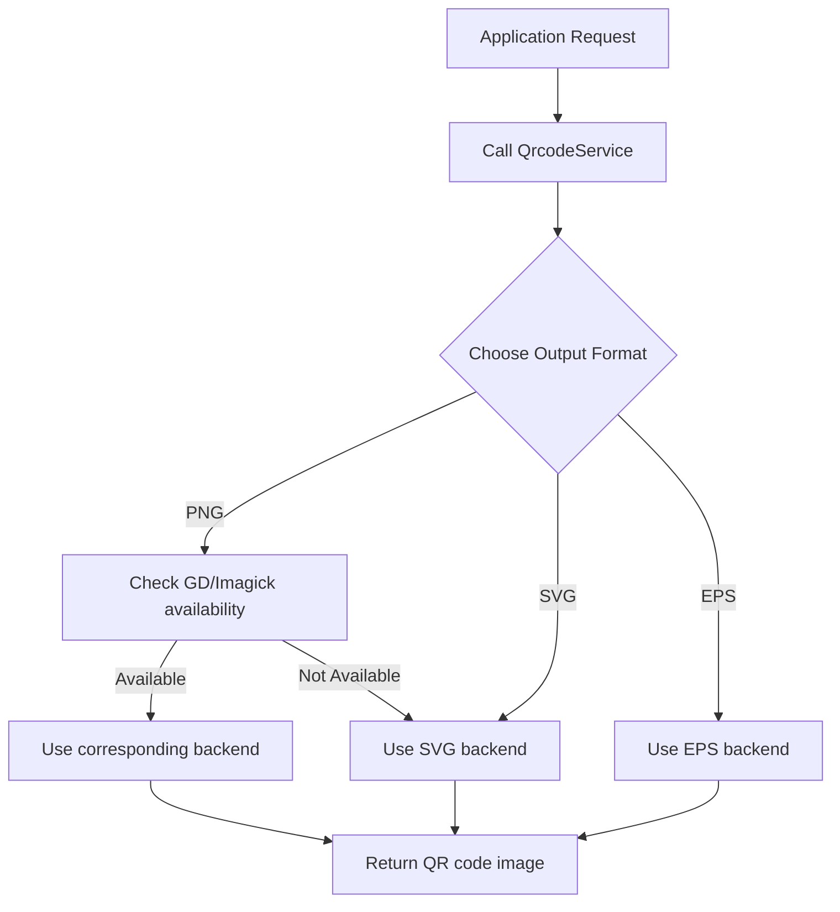

# Bacon QR Code Bundle

[English](README.md) | [中文](README.zh-CN.md)

[](https://packagist.org/packages/tourze/bacon-qr-code-bundle)
[](https://github.com/tourze/php-monorepo/blob/main/LICENSE)
[](https://packagist.org/packages/tourze/bacon-qr-code-bundle)

A Symfony bundle for [bacon/bacon-qr-code](https://github.com/Bacon/BaconQrCode) library that provides QR code generation capabilities in your Symfony application.

## Features

- Easy integration with Symfony applications
- Multiple output formats support (PNG, SVG, EPS)
- Customizable QR code size and margin
- Simple URL generation for QR codes
- Automatic detection of available image libraries (GD, Imagick)
- Twig function for easy template integration

## Requirements

- PHP 8.1 or higher
- Symfony 6.4 or higher
- ext-filter PHP extension
- One of the following image libraries (optional, for PNG support):
  - GD extension (ext-gd)
  - ImageMagick extension (ext-imagick)

## Installation

```bash
composer require tourze/bacon-qr-code-bundle
```

Register the bundle in your `config/bundles.php`:

```php
<?php

return [
    // ...
    BaconQrCodeBundle\BaconQrCodeBundle::class => ['all' => true],
];
```

Import routes in your `config/routes.yaml`:

```yaml
bacon_qr_code:
    resource: '@BaconQrCodeBundle/Resources/config/routes.yaml'
```

## Quick Start

### Generate QR Code URL

```php
<?php

use BaconQrCodeBundle\Service\QrcodeService;

class YourController
{
    public function example(QrcodeService $qrcodeService)
    {
        // Generate URL for QR code image
        $qrCodeUrl = $qrcodeService->getImageUrl('https://example.com');

        // Use this URL in your templates
        return $this->render('your_template.html.twig', [
            'qrCodeUrl' => $qrCodeUrl,
        ]);
    }
}
```

### Display QR Code in Twig Template

```twig
{# Using the controller variable #}


{# Using the Twig function #}


{# With custom parameters #}

```

### Direct QR Code Generation

```php
<?php

use BaconQrCodeBundle\Service\QrcodeService;
use Symfony\Component\HttpFoundation\Response;

class YourController
{
    public function generateQrCode(QrcodeService $qrcodeService): Response
    {
        $options = [
            'size' => 300,     // Size in pixels
            'margin' => 10,    // Margin in pixels
            'format' => 'png', // Format: 'png', 'svg', 'eps'
        ];

        // Return Response object with QR code content
        return $qrcodeService->generateQrCode('https://example.com', $options);
    }
}
```

## Twig Functions

### qr_code_url

Generate a QR code URL directly in your templates:

```twig
{# Basic usage #}


{# With different content types #}


{# Using variables #}

```

## Available Options

When generating QR codes, you can customize the following options:

| Option   | Description                                          | Default Value                       |
|----------|------------------------------------------------------|-------------------------------------|
| `size`   | Size of the QR code in pixels                        | 300                                 |
| `margin` | Margin around the QR code in pixels                  | 10                                  |
| `format` | Output format ('png', 'svg', 'eps')                  | 'png' if GD or Imagick is available, otherwise 'svg' |

## Workflow

The following diagram shows the QR code generation workflow:



## Testing

Run the tests using PHPUnit:

```bash
# Run all tests
./vendor/bin/phpunit packages/bacon-qr-code-bundle/tests

# Run with code coverage
./vendor/bin/phpunit packages/bacon-qr-code-bundle/tests --coverage-html coverage
```

## Contributing

Please see [CONTRIBUTING.md](https://github.com/tourze/php-monorepo/blob/main/CONTRIBUTING.md) for details.

## License

The MIT License (MIT). Please see [License File](LICENSE) for more information.
