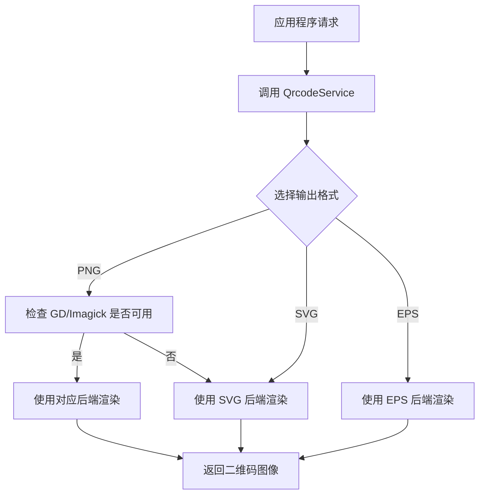

# Bacon QR Code Bundle

[English](README.md) | [中文](README.zh-CN.md)

[](https://packagist.org/packages/tourze/bacon-qr-code-bundle)
[](https://github.com/tourze/php-monorepo/blob/main/LICENSE)
[](https://packagist.org/packages/tourze/bacon-qr-code-bundle)

一个为 Symfony 应用程序提供二维码生成功能的 Bundle，基于 [bacon/bacon-qr-code](https://github.com/Bacon/BaconQrCode) 库实现。

## 功能特性

- 与 Symfony 应用程序轻松集成
- 支持多种输出格式（PNG, SVG, EPS）
- 可自定义二维码尺寸和边距
- 简单的二维码 URL 生成
- 自动检测可用的图像处理库（GD, Imagick）
- Twig 函数方便模板集成

## 系统要求

- PHP 8.1 或更高版本
- Symfony 6.4 或更高版本
- ext-filter PHP 扩展
- 以下图像库之一（可选，用于 PNG 支持）：
  - GD 扩展 (ext-gd)
  - ImageMagick 扩展 (ext-imagick)

## 安装

```bash
composer require tourze/bacon-qr-code-bundle
```

在 `config/bundles.php` 中注册 Bundle：

```php
<?php

return [
    // ...
    BaconQrCodeBundle\BaconQrCodeBundle::class => ['all' => true],
];
```

在 `config/routes.yaml` 中导入路由配置：

```yaml
bacon_qr_code:
    resource: '@BaconQrCodeBundle/Resources/config/routes.yaml'
```

## 快速开始

### 生成二维码 URL

```php
<?php

use BaconQrCodeBundle\Service\QrcodeService;

class YourController
{
    public function example(QrcodeService $qrcodeService)
    {
        // 生成二维码图片的 URL
        $qrCodeUrl = $qrcodeService->getImageUrl('https://example.com');

        // 在模板中使用这个 URL
        return $this->render('your_template.html.twig', [
            'qrCodeUrl' => $qrCodeUrl,
        ]);
    }
}
```

### 在 Twig 模板中显示二维码

```twig
{# 使用控制器传递的变量 #}


{# 使用 Twig 函数 #}


{# 使用自定义参数 #}

```

### 直接生成二维码

```php
<?php

use BaconQrCodeBundle\Service\QrcodeService;
use Symfony\Component\HttpFoundation\Response;

class YourController
{
    public function generateQrCode(QrcodeService $qrcodeService): Response
    {
        $options = [
            'size' => 300,     // 尺寸（像素）
            'margin' => 10,    // 边距（像素）
            'format' => 'png', // 格式：'png', 'svg', 'eps'
        ];

        // 返回包含二维码内容的 Response 对象
        return $qrcodeService->generateQrCode('https://example.com', $options);
    }
}
```

## Twig 函数

### qr_code_url

在模板中直接生成二维码 URL：

```twig
{# 基本用法 #}


{# 不同内容类型 #}


{# 使用变量 #}

```

## 可用选项

生成二维码时，可以自定义以下选项：

| 选项      | 描述                                    | 默认值                                    |
|----------|----------------------------------------|------------------------------------------|
| `size`   | 二维码尺寸（像素）                         | 300                                      |
| `margin` | 二维码周围的边距（像素）                    | 10                                       |
| `format` | 输出格式（'png', 'svg', 'eps'）          | 如果有 GD 或 Imagick 可用则为 'png'，否则为 'svg' |

## 工作流程

以下是二维码生成的基本工作流程：



## 测试

使用 PHPUnit 运行测试：

```bash
# 运行所有测试
./vendor/bin/phpunit packages/bacon-qr-code-bundle/tests

# 生成代码覆盖率报告
./vendor/bin/phpunit packages/bacon-qr-code-bundle/tests --coverage-html coverage
```

## 贡献指南

详情请查看 [CONTRIBUTING.md](https://github.com/tourze/php-monorepo/blob/main/CONTRIBUTING.md) 文件。

## 许可证

MIT 许可证。详情请查看 [License 文件](LICENSE)。
