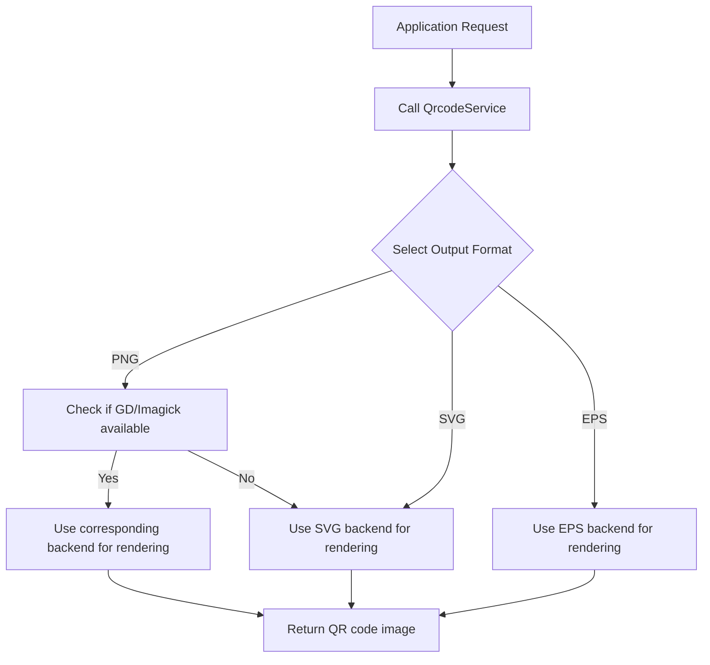
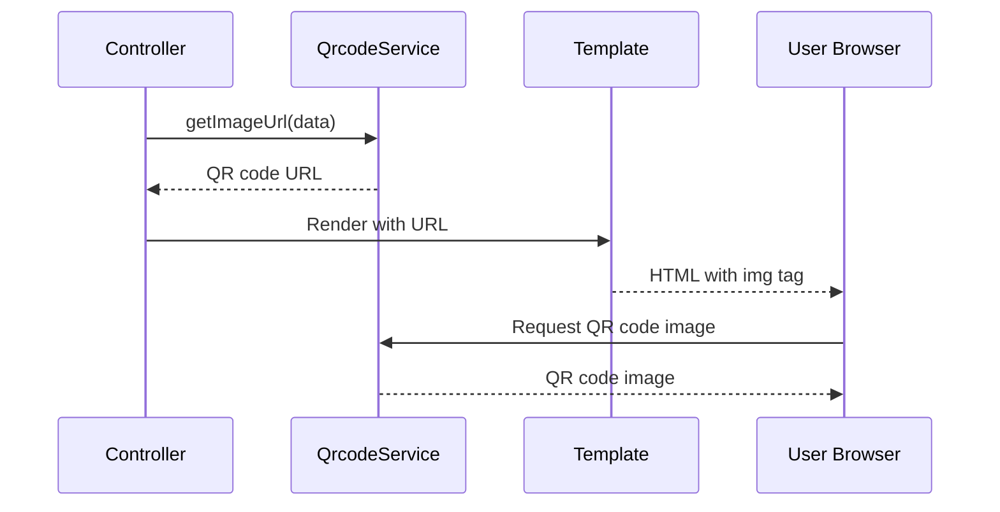
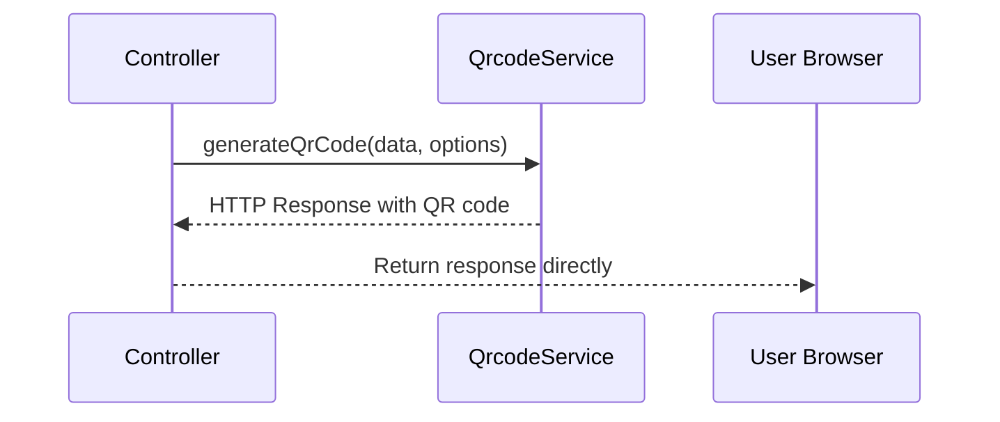

# QR Code Generation Workflow

This document describes the workflow of QR code generation in the Bacon QR Code Bundle.

## Basic Workflow

## Detailed Process

1. **Request Initiation**:
   - Direct call to `QrcodeService::generateQrCode()`
   - URL-based request via `GenerateController::renderCode()`

2. **Parameter Processing**:
   - Data to encode (required parameter)
   - Size (default: 300px)
   - Margin (default: 10px)
   - Format (default: determined by available libraries)

3. **Backend Selection**:
   - If format is PNG:
     - Try GD if available
     - Try Imagick if available
     - Fall back to SVG if neither is available
   - If format is SVG:
     - Use SVG backend
   - If format is EPS:
     - Use EPS backend

4. **Rendering Process**:
   - Create appropriate renderer
   - Initialize Writer with the renderer
   - Generate QR code content
   - Set correct MIME type in response

5. **Response Delivery**:
   - Return HTTP response with proper content type
   - PNG: `image/png`
   - SVG: `image/svg+xml`
   - EPS: `application/postscript`

## Integration Patterns

### Template Integration

### Direct Generation

